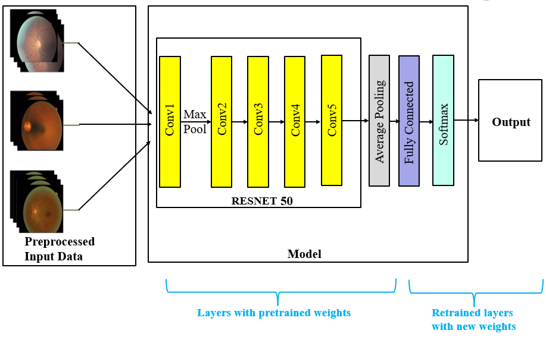
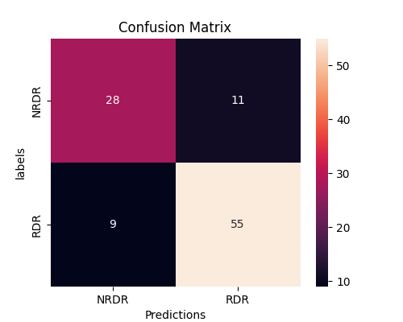
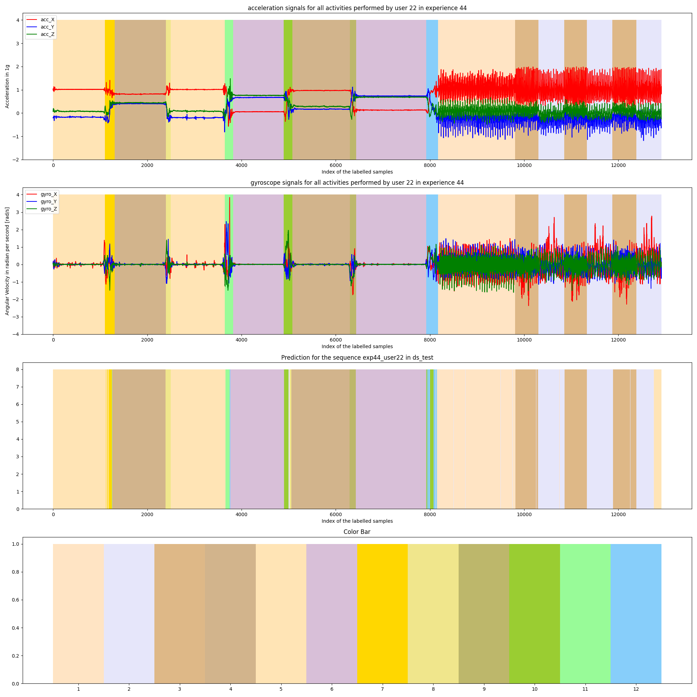
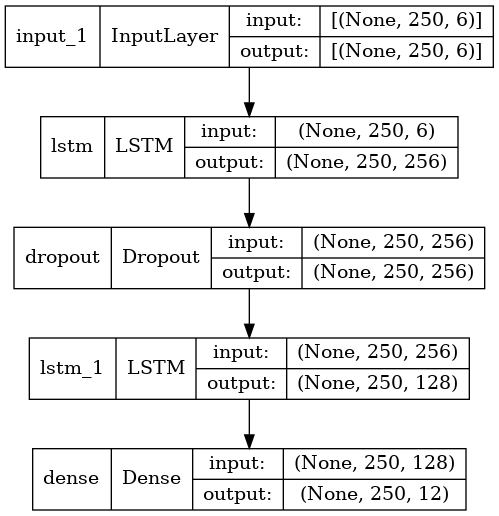
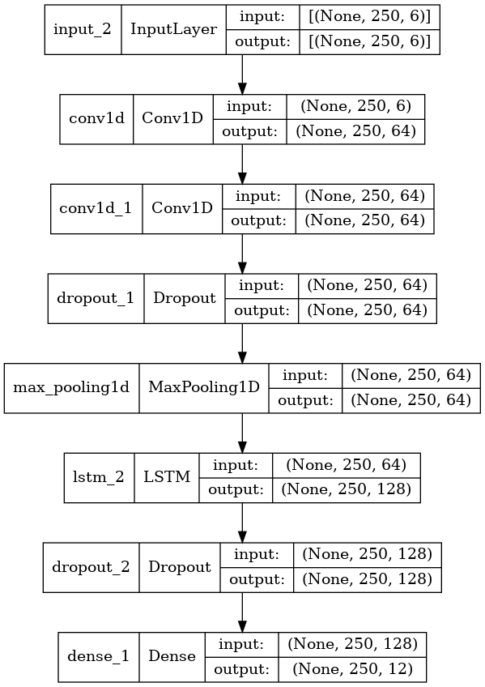
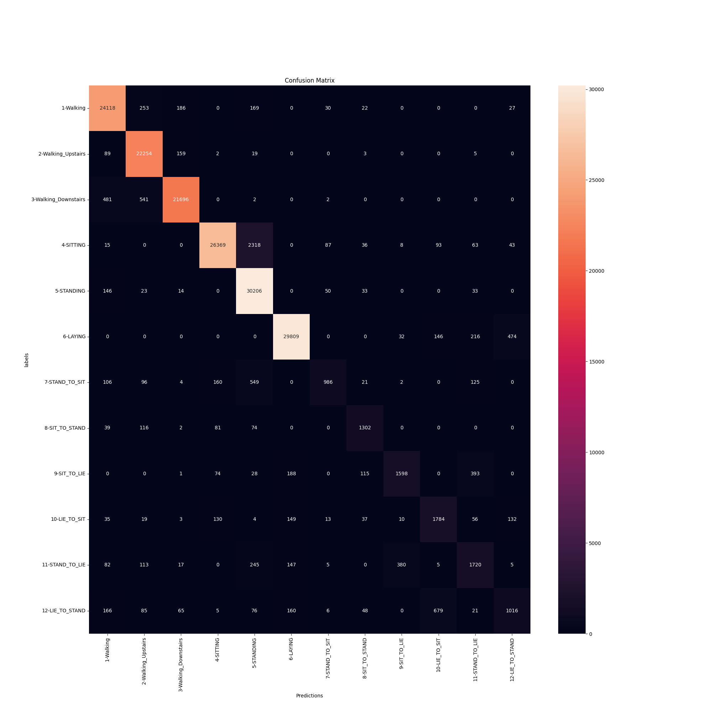

# Team09
- Hanjie Li (st146744)
- Banupriya Valluvan (st175151)

# Project: Diabetic Retinopathy
## Setup Environment:
    pip install -r /path/to/requirements.txt

1. All the run_paths can be found in experiments/. The experiments/ folder contains the checkpoints which are saved during the training. The folder experiments/ is in .gitignore and will be ignored by git.

2. All the logs can be found in logs/, where saves the tensorboard summary, is also set in .gitignore and will be ignored by git.

More details can be found in .gitignore.

The sequence of the codeflow in main.py is as follows:

*Dataset used : Indian Diabetic Retinopathy Image Dataset (IDRiD)*
- An input pipeline is set-up initially  
- A model architecture is built
- Training of the model 
- Evaluation of the model   
- Metrics - Confusion Matrix

# Results

*--------------------------------------------------------------------*  
*The overall test accuracy obtained is 84.02%.*  
*--------------------------------------------------------------------*  

## Dataset: 
1. IDRid dataset can be downloaded from https://ieee-dataport.org/open-access/indian-diabetic-retinopathy-image-dataset-idrid#files
2. The dataset should be saved under the path: 'diabetic_retinopathy/dataset'
3. The part 'B. Disease Grading' of the dataset is used in this project
4. Split of the dataset:  The original dataset consist of the train dataset and the test dataset. The validation dataset is splitted from the train dataset in code.

## Input Pipeline

## Model
The concept of Transfer learning is used in this project. The model is combined with the pretrained model ResNet50.

## Training
To start the training, set the train flag as TRUE in main.py     
    
    FLAGS = flags.FLAGS
    flags.DEFINE_boolean('train',True, 'Specify whether to train or evaluate a model.')
    
The new run paths are created with the following code in main function.
    
    run_paths = utils_params.gen_run_folder()
    

## Evaluation
step 1: Set the 'train' flag as FALSE in main.py 
    
    FLAGS = flags.FLAGS
    flags.DEFINE_boolean('train',False, 'Specify whether to train or evaluate a model.')loading checkpoints which are saved during the training loop
    
step 2: Load the checkpoints to restore the model in main.py, here the checkpoints store usually under the run paths 'experiments/run_currentime'. Here is an example:
    
    run_paths = utils_params.gen_run_folder('experiments/run_2022-02-07T19-55-11-759521_experiments')
    
 
1. The metric - Confusion matrix will be created and stored under the path 'diabetic_retinopathy/images/evaluation_confusion_matrix.png'

### Confusion Matrix

## Tensorboard and Profiling 
The following data is written in the tensorboard and can be used for addtional evaluation.
1. tf.summary.scalar: to log training losses, training accuracy, validation losses, validation accuracy, test losses, test accuracy
2. Images: train confusion matrix ,validation confusion matrix, test confusion matrix
3. Time-series data
4. Profiling : to understand the hardware resource consumption (time and memory) of the various TensorFlow operations (ops) in our model .

## Results
Test Acccuracy:
 - With Pretrained ResNet50 : Test Accuracy: 84%

*Dataset used : Human Activities and Postural Transitions Dataset(HAPT)*
- An input pipeline is set-up initially  
- A model architecture is built
- Training of the model 
- Evaluation of the model   
- Metrics - Confusion Matrix

# Results

*--------------------------------------------------------------------*  
*The overall test accuracy obtained is  around 94.02%.*  
*--------------------------------------------------------------------*  

### Data set: 
1. hapt data set download from https://archive.ics.uci.edu/ml/datasets/Smartphone-Based+Recognition+of+Human+Activities+and+Postural+Transitions
2. Raw data is used in this project
3. Split of the dataset:  
        - Train dataset: user-01 to user-21
        - Validation dataset: user-28 to user-30
        - Test dataset: user-22 to user-27

### Input Pipeline: 
1. new TFrecords can be created by running the following code in main.py: 
    
    from input_pipeline.preprocessing import load_data_in_df,delete_unlabeled_data,balance_ds,normalization,make_sliding_window,create_TFRecord
    a,b= load_data_in_df(raw_data_paths) # raw_data_paths = 'human_activity_recognition/Hapt Data Set/RawData/*'
    c = delete_unlabeled_data(a,b)
    d = balance_ds(c)
    e = normalization(c)
    f,g,h,i,j,k,l = make_sliding_window(e)
    create_TFRecord(f,g,h,i,j,k,l)
    
    Note: The path of .tfrecords can modified in create_TFRecord func

2. CategoricalCrossentropy loss function is used in the training loop, therefore is one-hot encoding of the labels necessary.
To avoid the 0 vector as the label, all labels are reduced 1 from the original value, e.g. 5 to 4, 1 to 0

### Data Visualization of a single activity
The visualisation of a sequence from test dataset representing the information (labels, prediction, accelrometer & gyroscape data) will be created.

### Model: 
The model architecture is as follows:
1.*Pure-LSTM*

2.*CNN-LSTM*

## Training
To start the training, set the train flag as TRUE in main.py     
    
    FLAGS = flags.FLAGS
    flags.DEFINE_boolean('train',True, 'Specify whether to train or evaluate a model.')
    
    loading checkpoints which are saved during the training loop
    
The new run paths are created with the following code in main function.
    
    run_paths = utils_params.gen_run_folder()

### Evaluation: 
step 1: Set the 'train' flag as FALSE in main.py 
    
    FLAGS = flags.FLAGS
    flags.DEFINE_boolean('train',False, 'Specify whether to train or evaluate a model.')loading checkpoints which are saved during the training loop
    
step 2: Load the checkpoints to restore the model in main.py, here the checkpoints store usually under the run paths 'experiments/run_currentime'. Here is an example:
    
    run_paths = utils_params.gen_run_folder('experiments/run_2022-02-07T19-55-11-759521_experiments')
    

### Tensorboard: 

The following data is written in the tensorboard and can be used for addtional evaluation.
1. tf.summary.scalar: to log training losses, training accuracy, validation losses, validation accuracy, test losses, test accuracy
2. Images: train confusion matrix ,validation confusion matrix, test confusion matrix
3. Time-series data
4. Profiling : to understand the hardware resource consumption (time and memory) of the various TensorFlow operations (ops) in our model .

### Results
Best test accuracy: Around 94.2%
worst test accuracy: Around 91.2%
